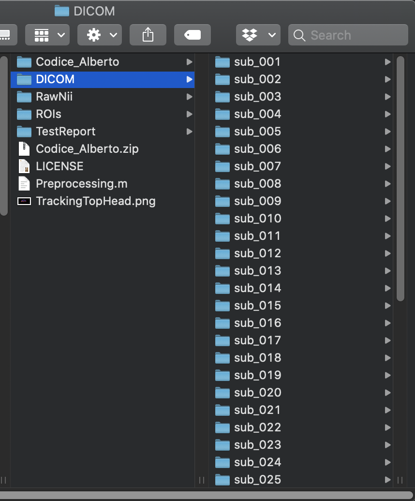

<p align="center">
<a href="https://github.com/delucaal/MRIToolkit"> 
 
 </a> 
 </p>

# MRIToolkit - BIDS like organization [update 14-03-2020] 
The Brain Imaging Data Structure [(BIDS)](https://en.wikipedia.org/wiki/Brain_Imaging_Data_Structure) makes the organization of large studies very convenient, and eases the scripting of complex pipelines.

To start, create a root folder for the project with a subfolder *DICOM*. In *DICOM*, copy (or link) all the DICOM folders of the subjects, as in this example:
<p align="center">

</p>

Then, type the following:
```matlab
addpath(path_to_mritoolkit)
MRIToolkitInit

cd(path_to_root_of_project)
NiftiIO_basic.OrganizeBIDSLike('DICOM',pwd)
```

The code will create a new folder RawNii, with one subfolder per subject.

**Soon, all methods in MRIToolkit will create a JSON file for each processing step**