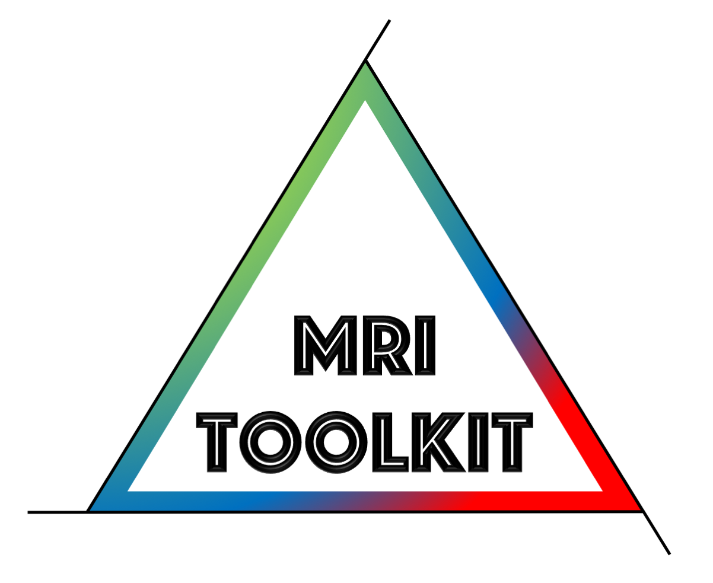
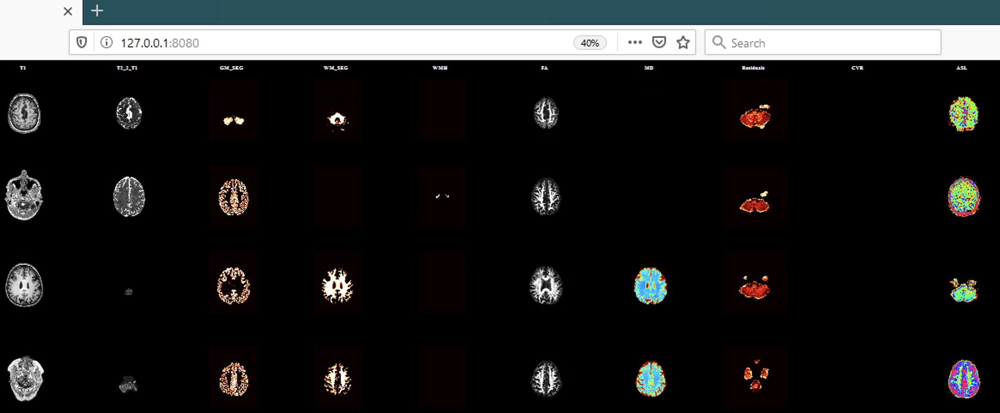

 
 

# MRIToolkit - Quality assessment of studies [update 14-03-2020] 
If the data has been organized according to the BIDS format, the class **ReportMaker** eases the creation of HTML reports, such as:

 

The implementation of this class is still a bit crude, but seems to work! Check out the example above for a quick startup.

Once the report has been generated, just open the file index.html to inspect all the dataset! A 3D viewer based on [Papaya](http://ric.uthscsa.edu/mango/papaya.html) is also embedded. To use that, you will need to start a Javascript webserver in the folder of the report, for instance with [node.js](https://nodejs.org/it/).

I will soon add more instructions on the steps above.