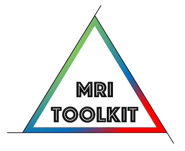

<p align="center">
<a href="https://github.com/delucaal/MRIToolkit"> 
 
 </a> 
 </p>

# MRIToolkit - Spectral Fit / Laplace / Robust deconvolution [update 14-03-2020] 
The method developed in [De Luca et al. 2018](https://pubmed.ncbi.nlm.nih.gov/30052293/) allows to perform a regularized Laplace fit of data at multiple diffusion weightings to disentangle an (ideally) arbitrary number of water pools, including IVIM, Free Water, and more.

Try the method as follows:
```matlab
MRTD.PerformSpectralDeconvolution('nii_file','sub-MRI_ses-1_dMRI_B2500_S15_MB2_v2_1_FP_denoised_MD_C_trafo_DWIs.nii','bval_file',...
'sub-MRI_ses-1_dMRI_B2500_S15_MB2_v2_1_FP_denoised_MD_C_trafo.bval','bvec_file',...
'sub-MRI_ses-1_dMRI_B2500_S15_MB2_v2_1_FP_denoised_MD_C_trafo.bvec','output','SpectralFit','min_bval',0.1,...
'max_bval',1100,'mask_file','sub-MRI_ses-1_dMRI_B2500_S15_MB2_v2_1_FP_denoised_MD_C_trafo_FA.nii.gz')
```