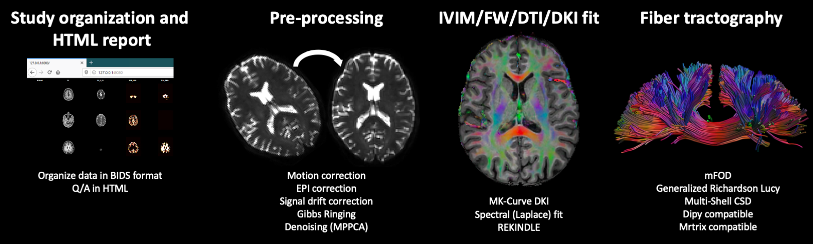
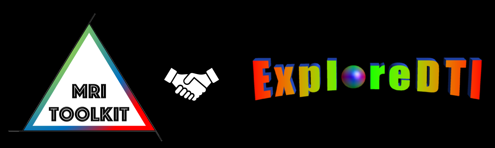

 
 

 
 # [MRIToolkit](https://github.com/delucaal/MRIToolkit) [update 17-02-2023] 
New in this version [1.6]: 
- This is the last stable release before a major change in structure. From the next release, all main functionalities will be come available as standalone commands and be designed to fully rely on Niftis only.
- Fixes to the handling of Nifti headers
- Automated brain extraction using image registration
- added new class MRT_Library that will collect all own methods currently in MRTTrack and MRTQuant (transition in progress). This will clean MRTTrack and MRTQuant which are meant as documented interfaces.
- Dramatic speed up of GRL and mFOD (major revision of MRTTrack.PerformDeconv)
- Changes to MRTQuant.LoadNifti and SaveNifti, which now allows to preserve the original header of NIFTIs (if required). In future releases, no modifications of the headers will be required.
- Update of Neuro.m to support the latest version of Elastix
- Compressed niftis are now (un)compressed in a temporary folder
- Added functions to track multiple FODs simultaneously
- Changes to the automatic handling of Q-S form of NIFTIs
- New mFOD fiber tracking
- New TerminateTractsWithFraction approach with 1 voxel tolerance
- Moved Trackers to aanother location
- Fixes to SHPrecomp
- Fixes to MRIToolkitInit
- Tractography can now use parallel computing
- Handling of NIFTI scaling factors
- Failsafe mode for registration
- Support for FSL Eddy
- Support for FOD normalization
- One call command to run GRL
- Fix for MSCSD (probably still needs amendment on the detection of data shells)
- Fix fot CAT12 processing
- command line fixes
- standardized preproc includes conformation
- fixes to conformation
- support for offset in DKI for GRL
- fixes to DKI export

Update 09-2021:
- [NEW] Checkout the [tutorial](https://github.com/delucaal/MRIToolkit/tree/master/GettingStarted/Diffusion/7_WMA) on how to install/use automated tractography clustering (WMA) algorithm with CSD/GRL/mFOD
- Fixes to MSCSD-related functions
- Fixes to WM automated clustering
- Support for Q-form in MRTTrack.ConformSpatialDimensions() 
- New FOD scaling mode for GRL/mFOD
- Renaming of some command line functions
- Added an option to customise the number of dRL iterations
- New functions to estimate SNR from b=0s/mm2 images (MRTQuant)

Update 17-02-2021:
- Run the CAT12 automatic pipeline for T1 images
- Code re-organization into two main classes: MRTQuant (preprocessing/DTI/DKI) and MRTrack (Tractography related)
- Support for automatic fiber clustering (see below for reference)
- Early support for integration with Python (needed for the point above)
- Support for VTK poly data 4.2 and 5.1 (also needed for the clustering)
- Added a robust option to GRL/mFOD deconvolution
- Initial support for storing the NIFTI Q/S form (to improve interoperability with other tools, not implemented yet)
- Integration with CAT12
 ## What is it?
MRIToolkit is a set of [command line tools](https://github.com/delucaal/MRIToolkit/tree/master/CommandLine) and a MATLAB (R) toolbox/library to process (diffusion) magnetic resonance imaging (MRI) data. Binaries of the command line version will be provided soon!

The idea behind MRIToolkit is to integrate [my research output](https://www.umcutrecht.nl/en/research/researchers/de-luca-alberto-a) with existing state-of-the-art methods for (diffusion) MRI processing. 

## Where do I find it?
- The MATLAB (R) toolbox is available [here](https://github.com/delucaal/MRIToolkit) on Github!
- The compiled [command line tools](https://github.com/delucaal/MRIToolkit/tree/master/CommandLine) will be uploaded soon!

## Explore the main functionalities:
<a href="GettingStarted"> 
  
 </a> 

The toolbox is referenced for the first time in [Guo et al.](https://arxiv.org/abs/1910.05372). Additionally, please cite the original works corresponding to the steps you use: 
- [ExploreDTI](http://www.exploredti.com): Leemans, A., Jeurissen, B., Sijbers, J., & Jones, D. K. (2009). ExploreDTI: a graphical toolbox for processing, analyzing, and visualizing diffusion MR data. 17th Annual Meeting of the International Society for Magnetic Resonance in Medicine, Honolulu, Hawaii, USA, 3537.
- Diffusion MRI pre-processing: ([signal drift correction](https://onlinelibrary.wiley.com/doi/full/10.1002/mrm.26124), [Gibbs ringing correction](https://www.ncbi.nlm.nih.gov/pubmed/26142273), motion and eddy currents correction, [B-matrix rotation](https://www.ncbi.nlm.nih.gov/pubmed/19319973), EPI correction, MPPCA denoising)
- [Diffusion Tensor Imaging (DTI)](https://pubmed.ncbi.nlm.nih.gov/8130344/) and [Diffusion Kurtosis Imaging (DKI)](https://pubmed.ncbi.nlm.nih.gov/15906300/) fit including the [MK-curve method](https://www.ncbi.nlm.nih.gov/pubmed/30978492);
- Spherical deconvolution using the Constrained Spherical Deconvolution [(CSD)](https://www.ncbi.nlm.nih.gov/pubmed/18583153), [Multi-shell CSD](https://www.sciencedirect.com/science/article/pii/S1053811914006442?via%3Dihub), [damped Richardson Lucy](https://www.ncbi.nlm.nih.gov/pubmed/19781650), the [Generalized Richardson Lucy](https://arxiv.org/abs/1910.05372) and [mFOD](https://www.biorxiv.org/content/10.1101/739136v1);
- Robust deconvolution of multiple water pools (NNLS/L2NNLS/PL2NNLS) as in [De Luca et al. 2018](https://onlinelibrary.wiley.com/doi/full/10.1002/nbm.3965)
- [NEW!] Automatic fiber clustering thanks to [WMA pipeline](https://github.com/SlicerDMRI/whitematteranalysis/tree/master/whitematteranalysis)

## Quick installation 
Please, see [this guide](img/MRIToolkitInstallationNotes.pdf)
- I have coded most functions to accept Python-like name/value argument couples. To know which arguments to specify, just try the MATLAB help as, for instance,  "help EDTI.LoadNifti"
- The file naming convention is to always indicate Niftis as .nii, even when they are actually compressed in .nii.gz. The code takes care of that, but expects only .nii as arguments in function calls!

## Getting started
Examples of some functionalities can be found in [here](https://github.com/delucaal/MRIToolkit/tree/master/GettingStarted)

###### Requirements:
- MRIToolkit relies on a couple of third party dependencies:
  - Elastix: 
    - 1) Either compile your own version or grab the executables for your platform [here](https://surfdrive.surf.nl/files/index.php/s/v8YMk8M49rCMB2q). 
    - 2) Copy the file "TemplateMRIToolkitDefineLocalVars.m" to your MATLAB default folder (user/MATLAB or Documents/MATLAB), rename the file as "MRIToolkitDefineLocalVars.m". 
    - 3) Edit the script, adjusting the variable MRIToolkit.Elastix.Location as needed.
  - NODDI toolbox: if you would like to try the mFOD method, you will need to add the [NODDI toolbox](http://mig.cs.ucl.ac.uk/index.php?n=Tutorial.NODDImatlab) to the MATLAB path.
  - ExploreDTI: While MRIToolkit is entirely self-sufficient (e.g. all needed ExploreDTI functions are bundled and adapted), the visualization of fiber tractograhy and other results will need ExploreDTI. Get it for free from [Alexander Leemans](www.exploredti.com).

###### Notes:
- **MRIToolkit is NOT approved for clinical use**
- This code is a work in progress. It will be updated without notice to ensure bug-fixes and the inclusion of best available methods

###### License:
- This software is distributed under the LGPLv3 license (https://opensource.org/licenses/lgpl-3.0.html).

###### Keywords:
- Magnetic Resonance Imaging (MRI)
- Image segmentation
- T1 quantification, Inversion Recovery
- T2 quantification, spin echo multi echo
- Extended Phase Graphs
- Diffusion MRI (dMRI) - Diffusion Tensor Imaging (DTI) - Diffusion Kurtosis Imaging (DKI)
- dMRI preprocessing - motion correction - eddy currents correction - EPI distortions correction
- Fiber tractography - Constrained Spherical Deconvolution (CSD) - Generalized Richardson Lucy (GRL) - mFOD
- Laplacian fit - Spectral Fit - Robust Deconvolution
- Automatic tractography clustering

## Toolbox components  [Content to be updated]
###### Ready to use:
- [x] **'ExploreDTIInterface'**: I am pleased to announce that MRIToolkit now contains, distributes and develops many functions originally developed as part of [ExploreDTI](www.exploredti.com). They are here available as a consolidated library and are planned to also become command line tools. A big thank to [Alexander Leemans](http://providi-lab.org) and Ben Jeurissen for this!  
- [x] **'SphericalDeconvolution'**: Methods used for two novel deconvolution methods we developed, namely the [Generalized Richardson Lucy](https://arxiv.org/abs/1910.05372) and [mFOD](https://www.biorxiv.org/content/10.1101/739136v1). Some of the functions here included have been taken from [Hardi Tools](https://www.neuroimagen.es/webs/hardi_tools/) of Erick Canales-Rodriguez.
- - [x] **'LesionEditor'**: a graphical user interface to visualise and edit segmentations of 3D MRI images, originally designed for delineation of multiple-sclerosis lesions on fluid attenuated inversion recovery (FLAIR) images. Requires MATLAB R2018a or newer. **Documentation coming soon**
- [x] **'NiftiIO_basic'**: Basic Nifti input/output, including code originally written by [Jimmy Shen](https://nl.mathworks.com/matlabcentral/fileexchange/8797-tools-for-nifti-and-analyze-image)
- [x] **'DW_basic'**: Utilities to load / manipulate / save dMRI data
- [x] **'OptimizationMethods'**: Classes and functions for numeric optimisation methods
- [x] **'Relaxometry'**: Classes for T1/T2 quantification using inversion-recovery / spin-echo multi-echo data
- [x] **'ThirdParty'**: Utilities from third parties used in other scripts. Includes EPG code from [Brian Hargreaves](http://web.stanford.edu/~bah/software/epg/)
- [x] **'ImageRegistrations'**: Image registration utils based on [Elastix](https://www.ncbi.nlm.nih.gov/pubmed/19923044)
- [x] **'GettingStarted'**: Small examples showcasing functionalities of MRIToolkit.
###### Being integrated and coming soon:
- [ ] **'Diffusion_basic'**: Class for (basic) dMRI quantification
- [ ] **'DW_IVIMDTDK_I'**: Diffusion MRI fit utilities - IVIM, DT, DKI - used in [De Luca et al. 2017](https://www.ncbi.nlm.nih.gov/pubmed/27538923)
- [ ] **'Dicom_utils'**: Tools for handling unconventional or buggy DICOMs

- [ ] **'MixedCodeUtils'**: 'Useful general purpose functions
- [ ] **'MRIfoundation'**: Classes for MRI sequences abstraction
- [ ] **'EPG_simulator'**: Classes for EPG simulations

###### Not yet planned for release (contact me directly if interested):
- **'dfMRI'**, Diffusion fMRI utilities used in [De Luca et al. 2019](https://onlinelibrary.wiley.com/doi/full/10.1002/hbm.24758)

Alberto De Luca - First published in 2019

